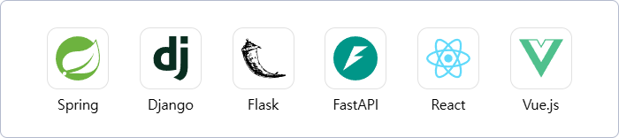

<h3 align="center"><b>연구 경험과 서비스를 연결해 실질적 가치를 만드는 엔지니어</b></h3>

  <i>Connecting research experience with real-world service value.</i>

## 💻 Tech Stack
  

  <table>
    <tr>
      <td align="center">
        <b>Core Programming</b> 
        
      </td>
      <td align="center">
        <b>Application</b> 
        
      </td>
    </tr>
    <tr>
      <td align="center">
        <b>Databases</b> 
        
      </td>
      <td align="center">
        <b>Infra Tools</b> 
        
      </td>
    </tr>
  </table>
  

## 🎓 Education
🎓 **M.S. in Computer Science, Yonsei University** (Mar 2021 – Feb 2023)  
• Database Laboratory  
• Large Data Micro-aggregation Based on Data Attribute Density Alignment

🎓 **B.A. in Computer Engineer, Catholic University** (Mar 2014 – Aug 2020)  
• Accounting (Double Major)

## 💼 Experience
🏢 **Ground One Co., Ltd.** — *Backend / DBA Engineer* (Nov 2025 – )  

🏢 **Cogcom Co., Ltd.** — *Backend / DBA Engineer* (Mar 2025 – Sep 2025)  

🏢 **Boara Co., Ltd.** — *Backend / DBA Engineer* (Jan 2023 – Jan 2025)  

## 📫 Blog
🌐 [Notion](https://www.notion.so/27c6821db72a8039aa1cf28c7a32c153?v=27c6821db72a8055a4d3000cc56eed85) 
